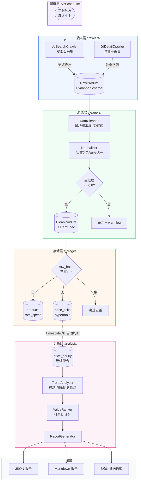

# 电商价格监控系统 — 架构设计文档

**版本**: v1.1  
**日期**: 2026-04-27  
**作者**: 首席架构师  
**MVP 范围**: 内存条品类全流程验证

---

## 1. 系统总览

```
目标：自动采集多平台硬件价格 → 清洗标准化 → 持久化时序存储 → 分析趋势 → 输出最优性价比装机组合
MVP：仅内存条品类，跑通 京东采集 → 清洗 → 入库 → 趋势查询 完整链路
```

### 1.1 技术选型

| 层次 | 选型 | 理由 |
|------|------|------|
| 语言 | Python 3.12 | 生态丰富，爬虫/数据处理首选 |
| 数据库 | PostgreSQL 16 + TimescaleDB | 关系模型管 SKU，时序扩展管价格曲线 |
| ORM | SQLAlchemy 2.x (async) | 异步支持，类型安全 |
| 数据校验 | Pydantic v2 | 跨层 schema 定义与验证 |
| 任务调度 | APScheduler / Celery | MVP 用 APScheduler，规模化升级 Celery |
| HTTP 客户端 | httpx (async) | 原生 async，连接池，超时控制 |
| 配置管理 | pydantic-settings | 环境变量注入，禁止硬编码密钥 |

---

## 2. 工程目录结构

```
price_monitor/
├── crawlers/                   # 【采集层】平台爬虫
│   ├── __init__.py
│   ├── base.py                 # 抽象基类 BaseCrawler
│   ├── jd/                     # 京东爬虫子包
│   │   ├── __init__.py
│   │   ├── search.py           # 搜索列表页采集
│   │   └── detail.py           # 商品详情页采集
│   ├── tmall/                  # 预留：天猫
│   └── schemas.py              # 原始采集数据 Pydantic schema（RawProduct）
│
├── cleaners/                   # 【清洗层】数据标准化
│   ├── __init__.py
│   ├── base.py                 # 抽象基类 BaseCleaner
│   ├── ram.py                  # 内存条专项清洗器（解析频率/时序/容量/颗粒）
│   ├── normalizer.py           # 通用字段归一化（品牌别名、单位换算）
│   └── schemas.py              # 清洗后标准数据 schema（CleanProduct, RamSpec）
│
├── models/                     # 【模型层】数据库表定义
│   ├── __init__.py
│   ├── base.py                 # DeclarativeBase + TimestampMixin
│   ├── platform.py             # Platform 表
│   ├── product.py              # Product 主表（跨平台 SKU）
│   ├── ram_spec.py             # RamSpec 规格表（1:1 关联 Product）
│   └── price_tick.py           # PriceTick 时序超表（TimescaleDB hypertable）
│
├── storage/                    # 【存储层】Repository 抽象
│   ├── __init__.py
│   ├── base.py                 # AbstractRepository 接口
│   ├── product_repo.py         # ProductRepository 实现
│   └── price_repo.py           # PriceRepository 实现
│
├── analysis/                   # 【分析层】趋势与性价比
│   ├── __init__.py
│   ├── trend.py                # 价格趋势分析（移动均值、历史低点）
│   ├── value_rank.py           # 性价比评分与排名
│   └── report.py              # 报告生成（JSON / Markdown 输出）
│
├── scheduler/                  # 【调度层】定时任务
│   ├── __init__.py
│   └── tasks.py                # 采集任务编排（定时触发、重试策略）
│
├── config/                     # 【配置层】
│   ├── __init__.py
│   └── settings.py             # pydantic-settings，读取 .env
│
├── db/                         # 【数据库工具】
│   ├── session.py              # async engine & session factory
│   └── migrations/             # Alembic 迁移脚本
│
├── tests/                      # 单元 + 集成测试
│   ├── crawlers/
│   ├── cleaners/
│   └── analysis/
│
├── .env.example                # 环境变量模板（不含真实密钥）
├── pyproject.toml
└── main.py                     # 入口：启动调度器
```

---

## 3. 数据库设计（PostgreSQL + TimescaleDB）

### 3.1 ER 关系总览

```
platforms (1) ──< (N) products (1) ──< (N) price_ticks [hypertable]
                         │
                         └──< (1) ram_specs
```

### 3.2 表定义

#### `platforms` — 平台目录

```sql
CREATE TABLE platforms (
    id          SMALLSERIAL PRIMARY KEY,
    code        VARCHAR(20)  NOT NULL UNIQUE,  -- 'jd' | 'tmall' | 'pdd'
    name        VARCHAR(50)  NOT NULL,
    base_url    VARCHAR(255) NOT NULL,
    created_at  TIMESTAMPTZ  NOT NULL DEFAULT NOW()
);
```

#### `products` — 跨平台商品主表

```sql
CREATE TABLE products (
    id              BIGSERIAL    PRIMARY KEY,
    platform_id     SMALLINT     NOT NULL REFERENCES platforms(id),
    platform_sku_id VARCHAR(64)  NOT NULL,          -- 平台原始商品 ID（如京东 item ID）
    category        VARCHAR(30)  NOT NULL,           -- 'ram' | 'cpu' | 'gpu'
    brand           VARCHAR(50)  NOT NULL,
    model           VARCHAR(100) NOT NULL,
    title           VARCHAR(500) NOT NULL,           -- 原始商品标题（保留备查）
    canonical_url   VARCHAR(500),
    is_active       BOOLEAN      NOT NULL DEFAULT TRUE,
    first_seen_at   TIMESTAMPTZ  NOT NULL DEFAULT NOW(),
    updated_at      TIMESTAMPTZ  NOT NULL DEFAULT NOW(),

    CONSTRAINT uq_platform_sku UNIQUE (platform_id, platform_sku_id)
);

CREATE INDEX idx_products_category_brand ON products (category, brand);
```

#### `ram_specs` — 内存条规格表（1:1 关联 products）

```sql
CREATE TABLE ram_specs (
    product_id      BIGINT       PRIMARY KEY REFERENCES products(id) ON DELETE CASCADE,

    -- 核心规格
    capacity_gb     SMALLINT     NOT NULL,           -- 单条容量（GB）：8 | 16 | 32 | 64
    kit_count       SMALLINT     NOT NULL DEFAULT 1, -- 套装数量：1 | 2
    total_gb        SMALLINT     GENERATED ALWAYS AS (capacity_gb * kit_count) STORED,

    -- 频率与时序
    speed_mhz       INT          NOT NULL,           -- 标称频率（MHz）：3200 | 6000 | 7200
    cl_latency      SMALLINT,                        -- CL 时序：16 | 18 | 30 | 36
    timing_string   VARCHAR(30),                     -- 完整时序串：'16-18-18-38'

    -- 颗粒与平台
    die_type        VARCHAR(20),                     -- 颗粒型号：'Samsung B-die' | 'Hynix M-die' | 'Micron'
    memory_type     VARCHAR(10)  NOT NULL,           -- 'DDR4' | 'DDR5'
    form_factor     VARCHAR(10)  NOT NULL DEFAULT 'DIMM', -- 'DIMM' | 'SO-DIMM'

    -- 外观与灯效
    has_rgb         BOOLEAN      NOT NULL DEFAULT FALSE,
    heatspreader    BOOLEAN      NOT NULL DEFAULT TRUE,
    color           VARCHAR(30),

    -- XMP/EXPO 支持
    xmp_version     VARCHAR(10),                     -- 'XMP 3.0' | NULL
    expo_supported  BOOLEAN      NOT NULL DEFAULT FALSE,

    -- 元数据
    parsed_at       TIMESTAMPTZ  NOT NULL DEFAULT NOW(),
    parse_confidence NUMERIC(3,2) NOT NULL DEFAULT 1.00  -- 解析置信度：0.00-1.00
);

CREATE INDEX idx_ram_specs_type_speed ON ram_specs (memory_type, speed_mhz);
CREATE INDEX idx_ram_specs_capacity   ON ram_specs (total_gb);
```

#### `price_ticks` — 价格时序超表（TimescaleDB hypertable）

```sql
CREATE TABLE price_ticks (
    id              BIGSERIAL,
    product_id      BIGINT       NOT NULL REFERENCES products(id),
    recorded_at     TIMESTAMPTZ  NOT NULL DEFAULT NOW(),  -- 分区键

    -- 价格字段（单位：分，避免浮点误差）
    price_fen       INT          NOT NULL,           -- 当前售价（分）
    original_fen    INT,                             -- 划线原价（分）
    coupon_fen      INT          NOT NULL DEFAULT 0, -- 可用优惠券（分）
    final_fen       INT GENERATED ALWAYS AS (price_fen - coupon_fen) STORED,

    -- 库存与促销状态
    in_stock        BOOLEAN      NOT NULL DEFAULT TRUE,
    promotion_tag   VARCHAR(100),                    -- '618满减' | '店铺优惠' | NULL

    -- 采集元数据
    crawler_version VARCHAR(20)  NOT NULL,
    raw_hash        CHAR(64),                        -- SHA-256 of raw response，用于去重

    PRIMARY KEY (id, recorded_at)
);

-- 转换为 TimescaleDB 超表，按天分区
SELECT create_hypertable('price_ticks', 'recorded_at', chunk_time_interval => INTERVAL '1 day');

-- 连续聚合：每小时最低价（供趋势分析高效查询）
CREATE MATERIALIZED VIEW price_hourly
WITH (timescaledb.continuous) AS
SELECT
    product_id,
    time_bucket('1 hour', recorded_at) AS bucket,
    MIN(final_fen)   AS min_final_fen,
    MAX(final_fen)   AS max_final_fen,
    AVG(final_fen)   AS avg_final_fen,
    COUNT(*)         AS tick_count
FROM price_ticks
GROUP BY product_id, bucket
WITH NO DATA;

CREATE INDEX idx_price_ticks_product ON price_ticks (product_id, recorded_at DESC);
```

### 3.3 SKU 唯一性策略

| 问题 | 策略 |
|------|------|
| 同商品多标题 | `platform_sku_id` 作为主键，标题仅存原始值 |
| 跨平台同款去重 | MVP 不做跨平台去重；预留 `canonical_product_id` 字段供后续扩展 |
| 规格解析失败 | `parse_confidence < 0.8` 时写入 `ram_specs` 但标记，不参与分析 |
| 价格去重 | `raw_hash` 相同的 tick 在采集层直接丢弃，不入库 |

---

## 4. 各层接口定义

### 4.1 采集层 — `BaseCrawler`

```python
# crawlers/base.py
from abc import ABC, abstractmethod
from typing import AsyncIterator
from .schemas import RawProduct

class BaseCrawler(ABC):
    platform_code: str  # 子类必须声明，如 'jd'

    @abstractmethod
    async def search(
        self,
        keyword: str,
        category: str,
        max_pages: int = 5,
    ) -> AsyncIterator[RawProduct]:
        """搜索关键词，流式返回原始商品数据。"""

    @abstractmethod
    async def fetch_detail(
        self,
        platform_sku_id: str,
    ) -> RawProduct | None:
        """根据 SKU ID 抓取单品详情，失败返回 None。"""

    @abstractmethod
    async def fetch_price(
        self,
        platform_sku_id: str,
    ) -> dict | None:
        """仅抓取价格字段（轻量调用，用于定时价格更新）。"""
```

```python
# crawlers/schemas.py
from pydantic import BaseModel, HttpUrl
from datetime import datetime

class RawProduct(BaseModel):
    platform_code:    str
    platform_sku_id:  str
    title:            str
    price_fen:        int           # 单位：分
    original_fen:     int | None
    coupon_fen:       int = 0
    in_stock:         bool = True
    promotion_tag:    str | None
    detail_url:       HttpUrl | None
    raw_payload:      dict           # 原始 JSON，供 debug
    crawled_at:       datetime
    crawler_version:  str
```

### 4.2 清洗层 — `BaseCleaner`

```python
# cleaners/base.py
from abc import ABC, abstractmethod
from crawlers.schemas import RawProduct
from .schemas import CleanProduct

class BaseCleaner(ABC):
    category: str  # 子类声明，如 'ram'

    @abstractmethod
    def clean(self, raw: RawProduct) -> CleanProduct | None:
        """
        清洗单条原始数据。
        返回 None 表示数据质量不达标，应丢弃。
        不抛异常，内部记录 warning log。
        """

    @abstractmethod
    def validate(self, product: CleanProduct) -> bool:
        """业务规则二次校验（如频率是否在合理范围内）。"""
```

```python
# cleaners/schemas.py
from pydantic import BaseModel, field_validator
from decimal import Decimal

class RamSpec(BaseModel):
    capacity_gb:      int
    kit_count:        int = 1
    speed_mhz:        int
    cl_latency:       int | None
    timing_string:    str | None
    die_type:         str | None
    memory_type:      str           # 'DDR4' | 'DDR5'
    form_factor:      str = 'DIMM'
    has_rgb:          bool = False
    xmp_version:      str | None
    expo_supported:   bool = False
    parse_confidence: Decimal       # 0.00 ~ 1.00

    @field_validator('speed_mhz')
    @classmethod
    def speed_in_range(cls, v: int) -> int:
        if not (800 <= v <= 12800):
            raise ValueError(f'speed_mhz {v} 超出合理范围')
        return v

class CleanProduct(BaseModel):
    platform_code:   str
    platform_sku_id: str
    category:        str
    brand:           str
    model:           str
    title:           str
    canonical_url:   str | None
    price_fen:       int
    original_fen:    int | None
    coupon_fen:      int
    in_stock:        bool
    promotion_tag:   str | None
    spec:            RamSpec | None   # MVP 仅 RamSpec，后续扩展 CpuSpec 等
    raw_hash:        str              # SHA-256
    crawled_at:      str              # ISO 8601
    crawler_version: str
```

### 4.3 存储层 — `AbstractRepository`

```python
# storage/base.py
from abc import ABC, abstractmethod
from cleaners.schemas import CleanProduct

class AbstractProductRepository(ABC):

    @abstractmethod
    async def upsert_product(self, product: CleanProduct) -> int:
        """插入或更新商品主表 + 规格表，返回 product.id。"""

    @abstractmethod
    async def get_by_platform_sku(
        self, platform_code: str, platform_sku_id: str
    ) -> dict | None:
        """按平台 SKU 查询商品，返回 None 表示不存在。"""

class AbstractPriceRepository(ABC):

    @abstractmethod
    async def record_price(
        self, product_id: int, product: CleanProduct
    ) -> bool:
        """
        写入价格 tick。
        若 raw_hash 已存在则跳过，返回 False；
        写入成功返回 True。
        """

    @abstractmethod
    async def get_price_history(
        self,
        product_id: int,
        days: int = 30,
    ) -> list[dict]:
        """返回近 N 天每小时最低价列表（查 price_hourly 连续聚合）。"""

    @abstractmethod
    async def get_current_lowest(
        self,
        category: str,
        filters: dict,
    ) -> list[dict]:
        """按过滤条件查当前最低价商品列表（用于性价比排名）。"""
```

### 4.4 分析层 — `AnalysisEngine`

```python
# analysis/trend.py
from dataclasses import dataclass

@dataclass
class TrendResult:
    product_id:       int
    current_fen:      int
    all_time_low_fen: int
    avg_30d_fen:      int
    drop_pct:         float   # 相比 30 天均价的降幅百分比
    trend_signal:     str     # 'falling' | 'stable' | 'rising'
    recommendation:  str     # 'buy_now' | 'wait' | 'watch'

class TrendAnalyzer:
    def analyze(self, price_history: list[dict]) -> TrendResult: ...

# analysis/value_rank.py
@dataclass
class ValueScore:
    product_id:   int
    score:        float        # 综合性价比分（0-100）
    price_score:  float        # 价格维度
    spec_score:   float        # 规格维度（频率/容量）
    trend_score:  float        # 时机维度

class ValueRanker:
    def rank(
        self,
        products: list[dict],
        trends:   list[TrendResult],
    ) -> list[ValueScore]: ...

# analysis/report.py
class ReportGenerator:
    def to_json(self, rankings: list[ValueScore]) -> str: ...
    def to_markdown(self, rankings: list[ValueScore]) -> str: ...
```

### 4.5 调度层 — 任务编排接口

```python
# scheduler/tasks.py

class CrawlTask:
    """
    单次采集任务，由调度器实例化并调用 run()。
    依赖注入：crawler, cleaner, product_repo, price_repo。
    """
    async def run(
        self,
        keyword: str,
        category: str,
        max_pages: int,
    ) -> CrawlTaskResult: ...

@dataclass
class CrawlTaskResult:
    total_fetched:  int
    total_cleaned:  int
    total_saved:    int
    total_skipped:  int     # 去重跳过
    errors:         list[str]
```

---

## 5. 数据流程图（Mermaid）



---

## 6. 模块间依赖规则（架构纪律）

```
采集层  →  清洗层  →  存储层  →  分析层
```

- **单向依赖**：上层不得 import 下层；分析层不调用采集层
- **跨层通信唯一媒介**：Pydantic schema（`RawProduct` / `CleanProduct`）
- **数据库访问收口**：只有 `storage/` 可操作 SQLAlchemy Session；分析层通过 Repository 接口读数据，禁止直接写 SQL

---

## 7. MVP 实施路径（阶段划分）

| 阶段 | 目标 | 验收标准 |
|------|------|----------|
| **P0** | 数据库建表 + Alembic 迁移 | `alembic upgrade head` 无报错，超表创建成功 |
| **P1** | 京东搜索采集（仅列表页） | 单次运行返回 ≥50 条 `RawProduct`，字段无缺失 |
| **P2** | `RamCleaner` 解析内存条规格 | 测试集 100 条，置信度 ≥ 0.8 占比 > 85% |
| **P3** | 存储写入 + 去重 | 重复运行不产生重复 tick，`upsert_product` 幂等 |
| **P4** | 趋势查询 + 报告输出 | 对指定 product_id 输出 30 天价格曲线 + 推荐信号 |

---

## 8. 技术决策（京东平台最佳实践）

### 8.1 反爬策略 — 分层混合方案

| 场景 | 工具 | 原因 |
|------|------|------|
| 搜索列表页 | `httpx` 直接请求 | `search.jd.com/Search?keyword=` 服务端渲染，无需 JS |
| 商品价格 | `httpx` 调价格 API | 京东有独立价格接口 `p.3.cn/prices/mgets?skuIds=J_{id}`，比渲染快 10 倍 |
| 详情页补全 | Playwright（降级） | 仅 httpx 拿不到字段时使用，不作主路径 |

**Cookie 管理**：MVP 用匿名请求拿公开价格；促销券价需 `pt_key`/`pt_pin`，手动维护 1 个账号，写入 `.env`。  
**频控**：单 IP 每分钟 < 30 次，`timeout=10s`，随机 `sleep(1~3s)`，User-Agent 轮换。

### 8.2 品牌别名字典 — 静态 YAML

见 `config/brand_aliases.yml`（随本文档一同交付）。  
理由：品牌映射是稳定的业务知识，YAML 比数据库表少一层 I/O，`normalizer.py` 启动时加载一次进内存。

### 8.3 颗粒型号解析 — 正则 + 关键词库

京东标题示例：`芝奇 DDR5 6000MHz 32GB(16G×2) CL30 幻锋戟 RGB`

```
容量：(\d+)GB\(?(\d+)[Gg]×(\d+)\)?   → capacity=16, kit=2
频率：(\d{4,5})(?:MHz|mhz)            → speed=6000
时序：CL(\d+)                          → cl=30
类型：关键词匹配 DDR4 / DDR5
颗粒：关键词库匹配（三星B-die / 海力士M-die / 镁光）
```

LLM 标注仅用于冷启动（一次性打 500 条训练正则），不进主流程。

### 8.4 调度规模化 — APScheduler 撑到 3 个平台

MVP 只做京东，APScheduler 足够。**升级触发条件**：接入平台 ≥ 3 个或每日采集量 > 10 万条，再迁移到 Celery + Redis。  
`CrawlTask.run()` 接口保持幂等，迁移时只换调度层，业务逻辑不动。

### 8.5 价格告警 — 飞书 Webhook

理由：无需 SDK，一个 `POST` 搞定，支持富文本卡片，国内接入比钉钉更简单。

```json
{
  "商品": "芝奇 DDR5 6000 32G",
  "当前价": "¥589",
  "历史低价": "¥549",
  "较30天均价": "↓ 12%",
  "信号": "观望 / 建议购入"
}
```

Webhook URL 存 `.env`，不进代码。
